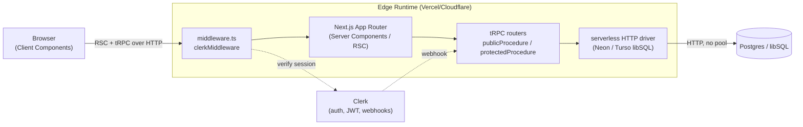
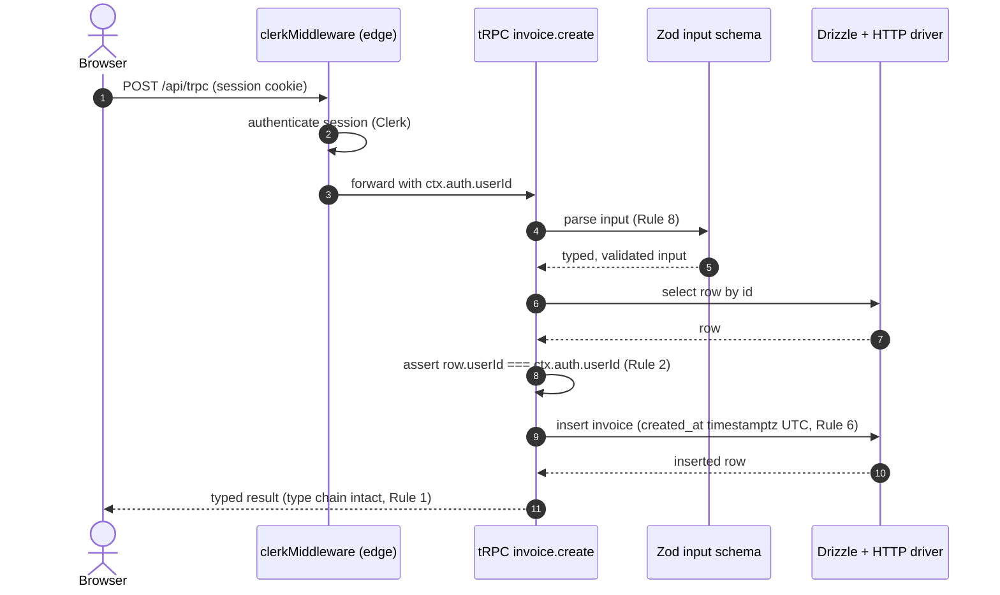
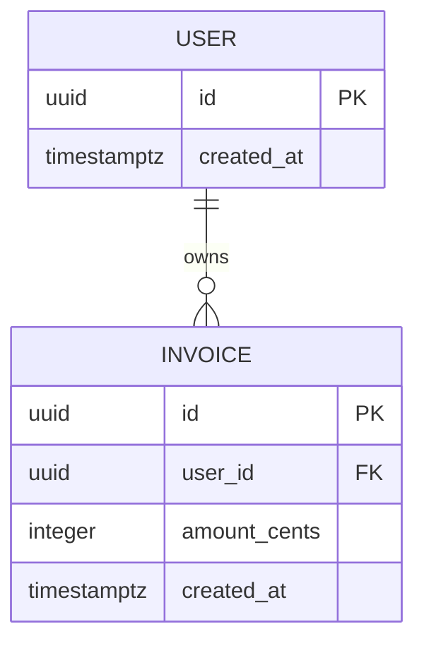

Purpose: copy-ready Mermaid for the three diagram types this skill produces, drawn against the decided edge stack — pick the type by the question, derive from code, make the edge boundary and ownership step explicit.

## Choosing the type

| Question the reader is asking | Diagram type | Mermaid keyword |
| --- | --- | --- |
| "What talks to what?" (containers/services) | architecture / container | `flowchart` (alias `graph`) |
| "What happens on this request, in order?" | sequence | `sequenceDiagram` |
| "How is the data shaped / related?" | entity-relationship | `erDiagram` |

Never mix them. If you find yourself adding an arrow of time to a flowchart, you want a sequence
diagram; if you add cardinality crow's-feet to a flowchart, you want an `erDiagram`.

All diagrams ship as a fenced block so GitHub, VS Code, and JetBrains render them inline:

````markdown

````

## 1. Architecture / container flowchart

Make the **edge runtime** boundary explicit with a `subgraph`. The edge target is the
fork-defining fact in ../../CLAUDE.md: no long-lived TCP pool, serverless/HTTP driver, the
server/client split visible.



Rules this encodes: the edge `subgraph` shows there is no long-lived pool (the driver speaks
HTTP); `clerkMiddleware` sits at the edge boundary; client vs server nodes are distinct so no
secret-bearing node is misplaced (Rule 9). Label nodes with real artifact names
(`middleware.ts`, the router name), not generic boxes.

## 2. Request sequence diagram

Auth and ownership are **separate arrows** (Rule 2): `clerkMiddleware` authenticates; the
procedure separately checks the row belongs to `ctx.auth.userId`. Zod parsing of the input is
its own step (Rule 8).



The two `P->>P`/`MW->>MW` self-steps — authenticate, then assert ownership — are the point.
Collapsing them into one "auth" box teaches the #1 vulnerability mental model. For a webhook
flow, the first actor is the external service and the verification step is the signature check.

## 3. Entity-relationship diagram (from the Drizzle schema)

Read this out of `src/db/schema/`, never from memory. Tables and columns are `snake_case`;
cardinality matches the foreign-key constraints (the schema conventions' explicit relations). Money columns are
integer minor units or decimal (Rule 5); timestamps are `timestamptz` (Rule 6).

Given schema like:

```ts
// src/db/schema/invoices.ts
export const users = pgTable("users", {
  id: uuid("id").primaryKey(),                 // UUIDv7, public-facing
  createdAt: timestamp("created_at", { withTimezone: true }).defaultNow().notNull(),
});

export const invoices = pgTable("invoices", {
  id: uuid("id").primaryKey(),
  userId: uuid("user_id").notNull().references(() => users.id),
  amountCents: integer("amount_cents").notNull(),   // Rule 5: minor units, never float
  createdAt: timestamp("created_at", { withTimezone: true }).defaultNow().notNull(),
});
```

draw:



Cardinality cheat sheet (Mermaid crow's-foot): `||--o{` one-to-many (a user has many invoices),
`||--||` one-to-one, `}o--o{` many-to-many (which in this stack means a join table — draw the
join table as its own entity, not a bare `}o--o{`). A one-to-many drawn as many-to-many is the
classic ER defect; verify against the `references(() => ...)` direction in the schema.
